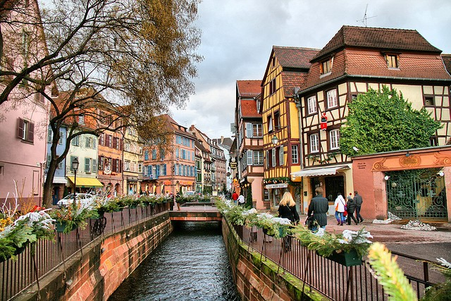

# ShebuninaAnne.github.io
<!doctype html>
<html>
  <head>
    <meta charset='utf-8'>
  <title>Мой любимый французский город</title>
  </head>
  <body>
   
<h1>Colmar</h1>
   
   
Население Кольмара:67257 человек

   <a href='https://ru.wikipedia.org/wiki/%D0%9A%D0%BE%D0%BB%D1%8C%D0%BC%D0%B0%D1%80'>Ссылка Википедии</a>
    
   <a href='https://github.com/ShebuninaAnne?tab=repositories'>Ссылка на мой сайт</a>
   

  Список:
  <ol>
  <li>Un</li>
  <li>Deux</li>
  <li>Trois</li>
  </body>
</html>
